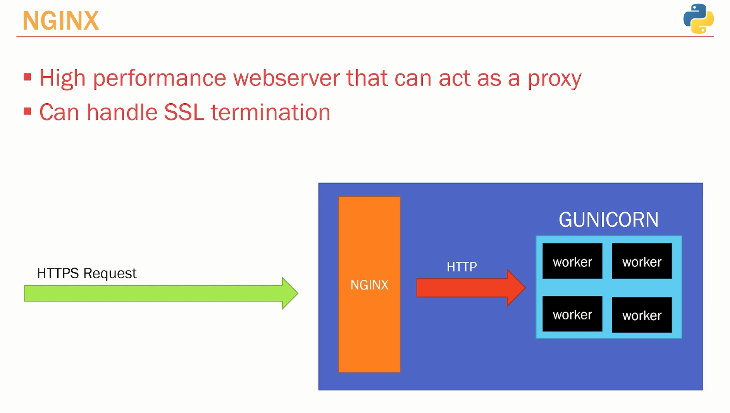

# NOTES

urllib.parse.quote_plus("P@$$w0rd").replace("%", "%%")

## Override SQLAlchemy URL

from urllib.parse import quote_plus

URL_encode_Password = quote_plus(settings.POSTGRES_PASSWORD).replace("%", "%%")  # URL-encode the password for handling special characters

SQLALCHEMY_DATABASE_URL = f"postgresql+psycopg2://{settings.POSTGRES_USER}:{URL_encode_Password}@{settings.POSTGRES_SERVER}:{settings.POSTGRES_PORT}/{settings.POSTGRES_DB}"

config.set_main_option("sqlalchemy.url", SQLALCHEMY_DATABASE_URL)

## Set Postman to save bearer token to environment variable

pm.environment.set("JWT", pm.response.json().access_token);

## Working on Production Server

## Configuring Custom SSH Key to Access Vagrant Machine

```bash
cat ~/.ssh/id_ed25519.pub | ssh -i ./Vagrant/.vagrant/machines/default/virtualbox/private_key vagrant@192.168.73.10 "mkdir -p ~/.ssh && cat >> ~/.ssh/authorized_keys && chmod 600 ~/.ssh/authorized_keys"
```

## System Update and Python Installation

```bash
sudo apt update && sudo apt upgrade -y
python3 --version

# Install Python 3.13
sudo add-apt-repository ppa:deadsnakes/ppa
sudo apt install python3.13 -y
python3.13 --version
python3.13 -m ensurepip --upgrade
sudo apt install python3-pip -y
sudo pip3 install virtualenv
```

## Install and Configure PostgreSQL

```bash
sudo apt install postgresql postgresql-contrib -y
psql --version
psql --help
psql -U postgres
```

### Resolving PostgreSQL Peer Authentication Issue

```bash
# For solving PostgreSQL peer authentication issue on Ubuntu
su - postgres
psql -U postgres
\password postgres
\q
exit

cd /etc/postgresql/16/main
sudo vim postgresql.conf   
    listen_addresses = '*'

sudo vim pg_hba.conf
    peer => md5
    ipv4   0.0.0.0/0
    ipv6   ::/0

# Database administrative login by Unix domain socket
local   all             postgres                                md5

# TYPE  DATABASE        USER            ADDRESS                 METHOD

# "local" is for Unix domain socket connections only
local   all             all                                     md5
# IPv4 local connections:
host    all             all             0.0.0.0/0               md5
# IPv6 local connections:
host    all             all             ::/0                    md5
```

### Restart PostgreSQL Service

```bash
sudo systemctl restart postgresql
```

### Connect Remotely or Locally with the Root User

```bash
psql -U postgres
```

### Create a New User for the App

```bash
sudo adduser fastapi
sudo usermod -aG sudo fastapi
```

## Managing Python Environment Using UV Package Manager

**Install UV Package Manager**

```bash
curl -LsSf https://astral.sh/uv/install.sh | sh
```

### Enable UV Shell Auto Completion

**Determine your shell (e.g., with `echo $SHELL`), then run one of:**

```bash
echo 'eval "$(uv generate-shell-completion bash)"' >> ~/.bashrc
echo 'eval "$(uv generate-shell-completion zsh)"' >> ~/.zshrc
echo 'uv generate-shell-completion fish | source' >> ~/.config/fish/config.fish
echo 'eval (uv generate-shell-completion elvish | slurp)' >> ~/.elvish/rc.elv

echo 'eval "$(uvx --generate-shell-completion bash)"' >> ~/.bashrc
echo 'eval "$(uvx --generate-shell-completion zsh)"' >> ~/.zshrc
echo 'uvx --generate-shell-completion fish | source' >> ~/.config/fish/config.fish
echo 'eval (uvx --generate-shell-completion elvish | slurp)' >> ~/.elvish/rc.elv
```

### Manage Python Versions and Dependencies

```bash
uv python list --only-installed
uv python install 3.13
uv python list --only-installed
uv venv -p 3.13
uv pip sync requirements.lock
```

### Update Requirements

```bash
uv pip install -r requirements.txt
```

### If You Update Requirements

```bash
pip freeze > requirements.txt
uv pip compile requirements.txt --output-file requirements.lock
```

### Run the App

- Note: This will give an error because we need to create the database first and update the environment variables

```bash
uvicorn app.main:app --reload
```

- Setting the environment variables manualy

touch -p ~/.env

export DATABASE_HOSTNAME=localhost
export DATABASE_PORT=5432
export DATABASE_NAME=social-media-db
export DATABASE_USERNAME=postgres
export DATABASE_PASSWORD=Daf28876#@

**this method doesn't presist after a reboot**

``` bash
set -o allexport; source /home/fastapi/.env
printenv

# Update .profile to read and set environment variables from the .env file
sudo vim .profile
set -o allexport; source /home/fastapi/.env

# Create the database
psql -U postgres
create database "social-media-db";
\l
\q

# Run the alembic migrations
alembic upgrade head

# Run the app 
uvicorn app.main:app --host 0.0.0.0

```

## Using a process manager to start the app

Running Uvicorn using a process manager ensures that you can run multiple processes in a resilient manner, and allows you to perform server upgrades without dropping requests.

Uvicorn includes a --workers option that allows you to run multiple worker processes.

```bash
uvicorn main:app --workers 4 
```

Gunicorn is probably the simplest way to run and manage Uvicorn in a production setting. Uvicorn includes a gunicorn worker class that means you can get set up with very little configuration.

The following will start Gunicorn with four worker processes:

```bash
gunicorn -w 4 -k uvicorn.workers.UvicornWorker

# check the running the processes
ps -aef | grep gunicorn
```

The UvicornWorker implementation uses the uvloop and httptools implementations. To run under PyPy you'll want to use pure-python implementation instead. You can do this by using the UvicornH11Worker class.

```bash
gunicorn -w 4 -k uvicorn.workers.UvicornH11Worker
```

## Create a systemd service script for running Gunicorn to serve your application

https://dev.to/tkirwa/create-a-systemd-service-script-for-running-gunicorn-to-serve-your-application-5aea

To create or edit a gunicorn.service file in Linux for running a Flask application, you need to create a systemd service unit file. This service unit file will define how Gunicorn should run your Flask application as a service. Here's a step-by-step guide:


1. Create or Edit the Gunicorn Service File:

``` bash
sudo vim /etc/systemd/system/gunicorn.service
```

To create a systemd service script for running Gunicorn to serve your application, you'll need to create a file named gunicorn.service with the following contents and place it in the appropriate directory on your server:

``` ini
[Unit]
Description=Gunicorn instance to serve social-media-api fastapi application
After=network.target

[Service]
User=your_username  # Replace with your username
Group=your_groupname  # Replace with your groupname (usually same as username)
WorkingDirectory=/path/to/your/app  # Replace with the path to your app directory
ExecStart=/path/to/your/venv/bin/gunicorn -w 4 -k uvicorn.workers.UvicornWorker app.main:app
Restart=always
ExecReload=/bin/kill -s HUP $MAINPID
KillMode=mixed
TimeoutStopSec=5
PrivateTmp=true

[Install]
WantedBy=multi-user.target

```
Replace the placeholders with your actual values:

* your_username: Your username on the system.
* your_groupname: Your primary group name on the system.
* /path/to/your/app: The absolute path to your application's root directory.
* /path/to/venv/bin: The absolute path to your virtual environment's bin directory.
* app.main:app: The Python import path to your Gunicorn app object.

To find your username and primary group name on a Unix-like system, you can use the id command. Open a terminal and type the following commands:
``` bash
# To get your username:
   id -un
# To get your primary group name:
   id -gn 
```

### Reload the systemd manager configuration to make it aware of the new service file:

``` bash
   sudo systemctl daemon-reload
```

Enable the service to start on boot:

``` bash
   sudo systemctl enable gunicorn
```

Start the service:

``` bash
   sudo systemctl start gunicorn
```

Verify that the service is running without errors:

``` bash
   sudo systemctl status gunicorn
```

You can also restart, stop, or check the logs of the service using systemd commands:

``` bash
   sudo systemctl restart gunicorn
   sudo systemctl stop gunicorn
   journalctl -u gunicorn
```

---


## Setup Nginx as a proxy to handle ssl termination and set up a domain name with SSL-Certificate

### 1. Setup nginx 



- High performance webserver that can act as a proxy
- Can handle SSL termination

1. Configure Nginx as a proxy to fastapi application

``` bash

cd /etc/nginx/sites-available
sudo vim ./default


server {
        listen 80 default_server;
        listen [::]:80 default_server;

        server_name _; # replace with specific domain name like sanjeev.com
        
        location / {
                proxy_pass http://localhost:8000;
                proxy_http_version 1.1;
                proxy_set_header X-Real-IP $remote_addr;
                proxy_set_header X-Forwarded-For $proxy_add_x_forwarded_for;
                proxy_set_header Upgrade $http_upgrade;
                proxy_set_header Connection 'upgrade';
                proxy_set_header Host $http_host;
                proxy_set_header X-NginX-Proxy true;
                proxy_redirect off;
        }
}

```

2. setup a domain name on namecheap or and domain provider

3. set the A name and CNAME with you domain in you cloud provider dns

4. Generate a new ssl certificate using certpot 
   follow instructions in this guide [Certbot guide](https://certbot.eff.org/instructions?ws=nginx&os=snap&tab=standard)

5. setup the server firewall to allow only http/https traffic 

sudo ufw allow http
sudo ufw allow https
sudo ufw allow ssh 
sudo ufw enable
sudo ufw status

if you want to delete a rule in the firewall

sudo ufw delete allow ssh
